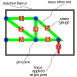
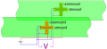
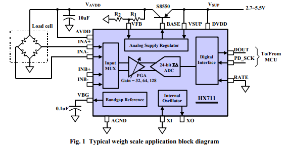

# experiment-truss-type1
Documentation, code, and designs for a remote lab truss experiment using some pre-existing parts

## Background

We are developing a remote-lab experiment on trusses for a structural mechanics course. Structures theory is materials-independent, working across a range of scales. Thus we require a truss structure made of a size and material that does not introduce the need for any correction factors. We already have the truss itself, with members, pin-joints and strain-gauges. We require to develop the electronic interface, user interface, and educational activities. 

### Requirements

- six member truss 
- one strain gauge per member
- can tare strain gauges at zero applied force
- can apply force up or down at end of truss, up to ca 150N
- load cell at point of force application
- analogue deflection measurement visible to students on camera
- static application of force, e.g. screw drive
- connect to [practable™](https://practable.io) remote lab ecosystem 

### Theory

There are a number of assumptions we must honour in the hardware

- members are pin connected
- pin joints are free of slop and friction
- loading only occurs at joints
- loading limited to prevent buckling/out-of-plane movement of members
- force/deflection/strain all to be measured in static equilibrium

### Practice

There are a number of considerations we must be aware of

- strain gauges have gage factor which represents their sensitivity
- mounting strain gauges is a specialist skill
- strain gauge tolerance is typically a few hundre micro-strain [see pE-104](https://www.omega.co.uk/techref/pdf/StrainGage_Measurement.pdf)
- mounting strain gauges changes their nominal value, so can't be used as a reference
- strain gauges require temperature compensation
- strain gauge resistance changes are small, so are typically measured in wheatstone bridges 
- strain gauges can produce noisy data
- the truss structure may have an internal time constant for the strains to equalise (even if only a second or two, this affects timing of movements, and sensing the straings)

### Educational Activities

We require the experiment to support the following tasks:

- tare the strain gauges to show zero strain in unloaded truss (i.e. zero out effect of self-loading)
- apply a known force to one pin joint 
- record the strain in each member (i.e. experiment to supply strain values)

#### Dimensions:

- truss is approx 400 by 800mm
- forces <= 150N
- strains in region of several hundreds of micro-strains

#### Things we do not require:

- measurement of deflection (it's proportional to force)
- automatic control of the force (i.e. students can adjust a screw thread in steps, until desired force achieved)

#### Desirable aspects

- qualitative visualisation of the deflection with a dial guage visible in the camera view 
	- movement of needle should be visible
    - dial guage need not be zeroed
	- the scale does not need to be readable
	
- some sort of sense of tension in the screw thread
  - use sound as an analogue, with increased pitch and reduced repetition frequency of 'clicks' representing higher tension
  - reduce the movement of a dial according to tension, so more "work" is required when moving the mouse/pressing keys to adjust

#### Performance:

Based on previous experience, we'd like:

- the difference between theory and experiment to be in the range of 1-10%
    - targeting <=5% for settled measurements. 
- we'd like the intrinsic time-dependent variation of the experimental strain values to be
    - within a single one-hour session to be <=5% 
    - within a two-month semester to be <= 10% 

The time-dependent variation will be subject to diurnal temperature fluctuations, which could traverse 5 - 20 degC

## Deeper dive

Some aspects that warrant a deeper-dive are as follows.

### Temperature dependence of the strain gauges

A helpful table of temperature dependent effects can be found at [hbm.com](https://www.hbm.com/en/6725/article-temperature-compensation-of-strain-gauges/) and is reproduced here:

Overview: Which quantities change temperature dependently and what you can do to counteract this

| Influence quantity                                 | Possible compensating measure                                                                                     |
|----------------------------------------------------|-------------------------------------------------------------------------------------------------------------------|
| Material expansion                                 | Use self-compensated strain gauges                                                                                |
| Cable resistance                                   | Use multiwire techniques                                                                                          |
| Temperature coefficient of the gauge factor        | Very low, usually ignored. Computational compensation while simultaneously measuring the temperature is possible. |
| Temperature influence on the modulus of elasticity | Usually ignored                                                                                                   |
| Self-heating of the strain gauge                   | Observe the maximum excitation voltage                                                                            |
| Climate/relative humidity                          | Careful covering of the measuring point                                                                           |
| Adhesive creep                                     | Observe the temperature limits of the adhesive you are using                                                      |
|                                                    |                                                                                                                   |

It would be helpful to have self-compensated strain gauges to avoid apparent strain from material expansion with temperature. E.g. we probably need a code 8 (plastic, alpha = 65 micro/K). A residual non-linear component can be removed computationally, if the temperature is known.

### Measurement sensitivity

We can double the measurement sensitivity by using a full bridge, with a strain gauge on either side of each member. The other two elements in the wheatstone bridge are identical strain gauges oriented perpendicular to the strain direction, intended to provide temperature compensation by being a dummy gauge [Fig 5, NI AN078](./doc/NI_AN078_Strain_Gauge_Meas.pdf). Applied to a member, we get this layout/connection:

### Signal conditioning

We can devolve the analogue to digital conversion to a chip designed especially for use with load cells, with the advantage of 
  - obtaining a gain stage not typically present in microcontroller ADC ports
  - obtaining parallel readings not typically possible in multiplexed microcontroller ADC ports
  
An example chip is the [HX711](./doc/hx711_english.pdf). This has a 24-bit digital serial output, which can be clocked by the microcontroller.

Note the use of a pass transistor between the power supply and the bridge, for regulating the analogue supply to the wheatstone bridge, and a smoothing cap.

We can read all the HX711 outputs in parallel by using a common PD_SCK connection to the microntroller. Each digital input D0-D7 collects the digitised input one bit at a time for the corresponding HX711.

The fan-out required to power the PD_SCK lines appears within the capability of an arduino - inferring this from the total power to an HX711 being ca. 1.5 mA under normal conditions, and the source/sink of an arduino output being ca. 25 mA. The microcontroller could be tasked solely with reading the HX711 and transmitting the value to another microcontroller which coordinates the experiment. SPI offers bidirectional communication, but also the convenience of a peripheral select line, so that no address setting is needed on the peripheral board. Thus, more than eight channels can be achieved, so long as the controlling microcontroller has enough spare lines to operate individual peripheral select lines to each of the eight-channel ADC boards.

The schematic below shows prototype hardware that is in development  and is currently being tested. A separate HX711 breakout board is used for each strain gauge (only 2 displayed on schematic). The Arduinos communicate via I2C on pins A4 and A5.

